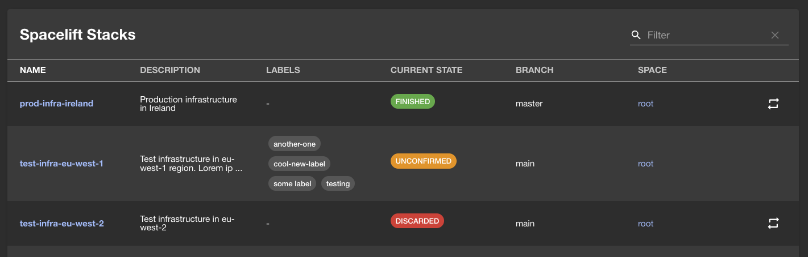
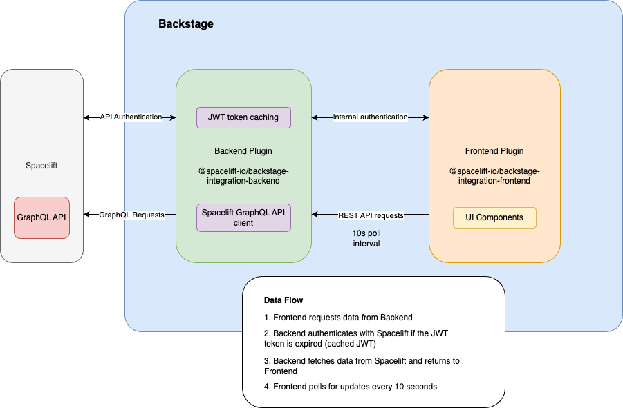

# Backstage Plugins for Spacelift

This repository contains Backstage plugins designed to integrate with [Spacelift](https://spacelift.io/), a sophisticated CI/CD platform for Infrastructure-as-Code.

These plugins allow you to view and interact with your Spacelift stacks and runs directly within your Backstage instance.

## Available Plugins

This monorepo hosts the following plugins:

- **[Spacelift Backend Plugin](./packages/spacelift-io-backend/README.md)**: Handles communication with the Spacelift API and provides data to the frontend. Published as `@spacelift-io/backstage-integration-backend`.
  - [View README](./packages/spacelift-io-backend/README.md)
- **[Spacelift Frontend Plugin](./packages/spacelift-io-frontend/README.md)**: Provides the user interface components to display Spacelift information within Backstage. Published as `@spacelift-io/backstage-integration-frontend`.
  - [View README](./packages/spacelift-io-frontend/README.md)

## Overview

The **Spacelift Backend Plugin** is responsible for:

- Authenticating with the Spacelift API using your credentials.
- Fetching data about your stacks (e.g., status, branch, last run).
- Proxying requests from the frontend to the Spacelift API.

The **Spacelift Frontend Plugin** provides:

- A dedicated page within Backstage to list and view your Spacelift stacks.
- Information about recent runs for each stack.
- Links to directly access your resources in Spacelift.



## Getting Started

To use these plugins, you will need to install and configure both the backend and frontend packages in your Backstage application. Detailed instructions can be found in the respective README files linked above.

### Prerequisites

- A running Backstage instance.
- A Spacelift account and API credentials (API Key ID and API Key Secret).

### Configuration Summary

You will need to add the following configuration to your `app-config.yaml`:

```yaml
spacelift:
  hostUrl: '<your-subdomain>.app.spacelift.io' # Your Spacelift instance URL (WITHOUT https://)
  apiKey: ${SPACELIFT_API_KEY} # Your Spacelift API Key ID (for backend)
  apiSecret: ${SPACELIFT_API_SECRET} # Your Spacelift API Key Secret (for backend)
```

Refer to the individual plugin READMEs for more specific installation and configuration steps.

### Important Note on Permissions

These plugins operate using the permissions granted to the Spacelift API Key configured in the backend. They do not currently implement any additional user-level permission handling within Backstage.

It is the responsibility of the Backstage instance administrator to ensure that appropriate Backstage permissions are configured to control access to the Spacelift plugin pages and features, thereby preventing unauthorized actions or information exposure.

## Project Structure

This project is organized as a monorepo with separate packages for the backend and frontend plugins:

```txt
backstage-plugins/
├── docs/                         # Documentation resources
├── packages/
│   ├── spacelift-io-backend/     # Backend plugin package
│   │   ├── src/
│   │   │   └── services/         # Backend services
│   │   │       └── Spacelift/    # Spacelift API client services
│   │   └── package.json          # Backend package manifest
│   │
│   └── spacelift-io-frontend/    # Frontend plugin package
│       ├── src/
│       │   ├── api/              # API clients
│       │   ├── components/       # React components
│       │   └── hooks/            # React hooks
│       └── package.json          # Frontend package manifest
└── package.json                  # Root package manifest
```

### Architecture

The plugins use a simple architecture where the frontend communicates with the backend via REST APIs, and the backend communicates with Spacelift via GraphQL:



_Note: The architecture diagram source is available as a DrawIO file in the [docs directory](./docs/plugins-architecture.drawio)._

#### Key Components

1. **Frontend Plugin**:

   - UI Components for displaying Spacelift stacks
   - API client for communicating with the backend plugin
   - React hooks for data fetching with automatic polling

2. **Backend Plugin**:

   - Express Router handling REST API endpoints
   - JWT token handling and caching mechanism
   - GraphQL client for Spacelift API communication
   - Data validation and error handling

3. **Data Flow**:
   - Frontend requests data from Backend
   - Backend authenticates with Spacelift if JWT token is expired
   - Backend fetches data from Spacelift and returns to Frontend
   - Frontend polls for updates every 10 seconds

## Contribution

Contributions are welcome! Please open an issue to discuss potential changes.

## Compatibility

These plugins are compatible with:

| Plugin   | Backstage Compatibility                                                                           |
| -------- | ------------------------------------------------------------------------------------------------- |
| Frontend | Requires Backstage `@backstage/core-components` >= 0.17.1, `@backstage/core-plugin-api` >= 1.10.6 |
| Backend  | Requires Backstage `@backstage/backend-plugin-api` >= 1.3.0                                       |

We recommend using these plugins with Backstage version 1.17.0 or later to ensure full compatibility.

## License

This project is licensed under the MIT License - see the [LICENSE](./LICENSE) file for details.
